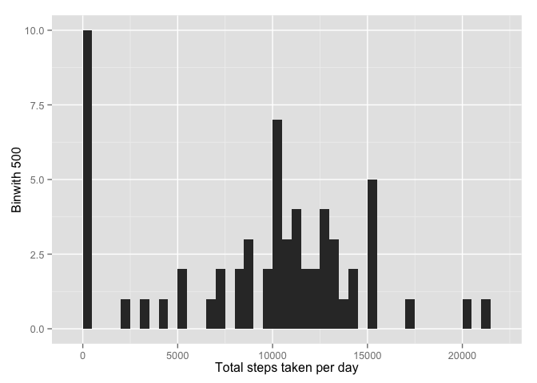
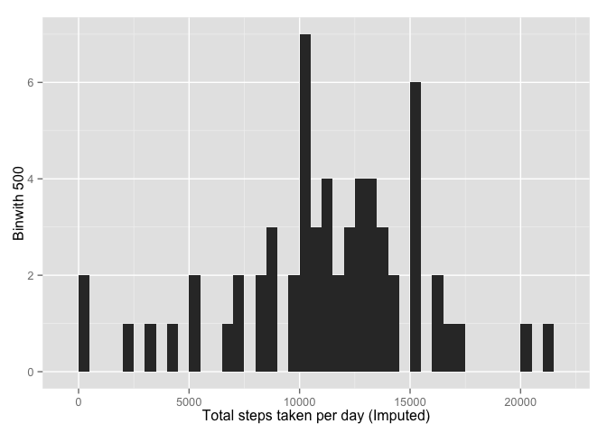
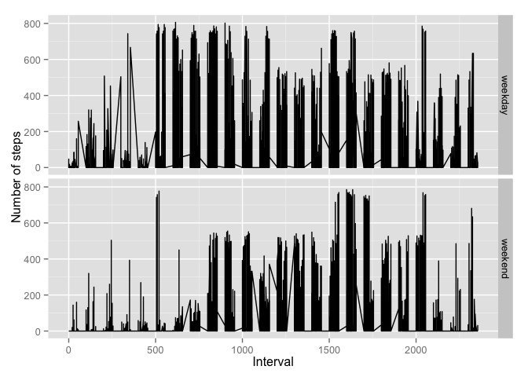

# Reproducible Research: Peer Assessment 1
Load various libraries for later use. ggplot2 for plotting chart. Mice for imputation.


```r
library(ggplot2)
library(mice)
```

```
## Loading required package: Rcpp
## Loading required package: lattice
## mice 2.22 2014-06-10
```
## Loading and preprocessing the data

```r
unzip(zipfile="activity.zip")
data <- read.csv("activity.csv")
```

## What is mean total number of steps taken per day?

```r
steps <- tapply(data$steps, data$date, sum, na.rm=TRUE)
```

##### 1. Make a histogram of the total number of steps taken each day

```r
qplot(steps, xlab='Total steps taken per day', ylab='Binwith 500', binwidth=500)
```

 

##### 2. Calculate and report the mean and median total number of steps taken per day

```r
stepsMean <- as.integer(mean(steps))
stepsMedian <- median(steps)
```
* Mean: 9354
* Median: 10395

## What is the average daily activity pattern?

##### 1. Make a time series plot

```r
averages <- aggregate(x=list(steps=data$steps), by=list(interval=data$interval), mean, na.rm=TRUE)
ggplot(data=averages, aes(x=interval, y=steps)) +
    geom_line() +
    xlab("5-minute interval") +
    ylab("average number of steps taken")
```

 

##### 2. 5-minute interval, on average across all the days in the dataset, that contains the maximum number of steps:

```r
averages[which.max(averages$steps),]
```

```
##     interval    steps
## 104      835 206.1698
```

## Imputing missing values

##### 1. The total number of missing values in the dataset (i.e. the total number of rows with NAs)

```r
length(which(is.na(data$steps)))
```

```
## [1] 2304
```

##### 2. Create new dataset by filling in all of the missing values in the dataset using "Multivariate Imputation by Chained Equations (MICE)"

```r
dataImputed <- complete(mice(data))
```

##### 4. Recreate histogram of the total number of steps taken each day with the new dataset

```r
stepsImp <- tapply(dataImputed$steps, dataImputed$date, sum, na.rm=TRUE)
qplot(stepsImp, xlab='Total steps taken per day (Imputed)', ylab='Binwith 500', binwidth=500)
```

 


```r
stepsMeanImp <- as.integer(mean(stepsImp))
stepsMedianImp <- median(stepsImp)
```
* Mean (Imputed): 11284
* Median (Imputed): 11458

Mean and median values are higher after imputing missing data. In the original data, some days with NA steps values for any interval are set to 0s by default. Imputing missing steps values, most of these 0 values are removed from the histogram of total number of steps taken each day.

## Are there differences in activity patterns between weekdays and weekends?

##### 1. Create new factor variable, dayType, to indicate whether a given date is a weekday or weekend day.

```r
dataImputed$dayType <- ifelse(as.POSIXlt(dataImputed$date)$wday %in% c(0,6), 'weekend', 'weekday')
```

##### 2. Make a panel plot containing a time series plot

```r
averagedImp <- aggregate(steps ~ interval + dayType, data=dataImputed, mean)
ggplot(dataImputed, aes(interval, steps)) + 
    geom_line() + 
    facet_grid(dayType ~ .) +
    xlab("Interval") + 
    ylab("Number of steps")
```

 
